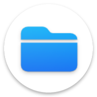
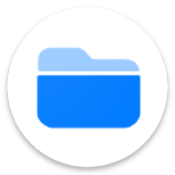

  

# Right Files/Alright Files
Alright Files is a clean, open-source file manager built for privacy. No ads. No trackers. No unnecessary permissions. Just fast, reliable file browsing with a fully customizable interface — switch themes, adjust layouts, and make it yours. Copy, move, rename, delete, and organize files with ease. Your data stays on your device, always.
  

## Wireless File Sharing (FTP Server)
This update expands the navigation with a dedicated 4th UI screen featuring a built-in FTP server. Seamlessly transfer and manage files wirelessly between your Android device and PC or local network—without relying on third-party cloud services or external servers. All transfers stay strictly within your local Wi-Fi/Hotspot connection, keeping your data private and on your device, always.

 &nbsp; &nbsp; &nbsp; &nbsp;

*Based on [Goodwy File Manager](https://github.com/Goodwy/File-Manager), [Simple File Manager](https://github.com/SimpleMobileTools/Simple-File-Manager), [Fossify File Manager](https://github.com/FossifyOrg/File-Manager).*

